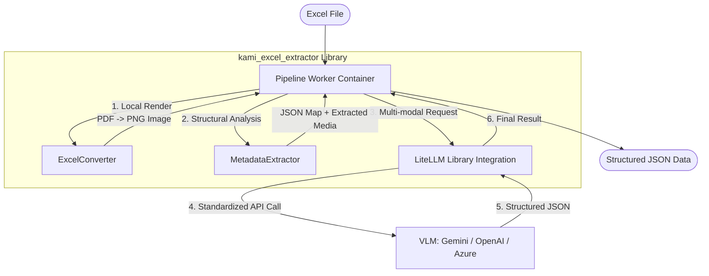

# **システムアーキテクチャ定義 (実証済み)**

本システムは、Excelドキュメントの視覚情報（画像）と論理構造（メタデータ・埋め込みメディア）を組み合わせ、VLM（Vision Language Model）を用いて高度な構造化データ抽出を実現する。

## **1. システム全体図**

## **2. 実装済みコンポーネントの役割**

### **A. ExcelConverter (LibreOffice + Poppler)**
- **役割:** Excelを物理画像に変換。
- **2-Step Process:** ヘッドレス環境でのCalcの不安定さを回避するため、「Excel -> PDF (soffice)」→「PDF -> PNG (pdftocairo)」のフローを採用。
- **並行処理:** UUIDベースの一時プロファイル（UserInstallation）による隔離実行。

### **B. MetadataExtractor (openpyxl + Media Logic)**
- **論理抽出:** セルの値、結合状態、背景色、罫線情報を座標付きで抽出。
- **メディア抽出:** シート内に埋め込まれた画像（現場写真等）を物理ファイルとして抽出し、座標マップに記録。

### **C. KamiExcelExtractor (Core Orchestrator)**
- **統合ロジック:** 視覚情報と論理情報を統合し、マルチモーダル・プロンプト（OpenAI互換形式）を構成。
- **モデル自動判別:** 利用可能な最新のFlashモデルを自動的に選択。

### **D. LiteLLM Integration**
- **役割:** プロバイダー（Google, OpenAI, Microsoft）のAPI差異をライブラリ層で吸収。
- **柔軟性:** モデル名のプレフィックス（`openai/`, `gemini/`）を変えるだけでコード変更なしにモデル切替が可能。

## **3. 実証されたデータフロー**

1.  **入力:** Excelファイル（方眼紙、複数シート、写真入り等）を検知。
2.  **前処理:** 
    - PDFを経由して高品質なPNGを生成。
    - XMLをパースして全シートの「情報の地図」と「写真ファイル」を抽出。
3.  **VLM推論:** LiteLLMを介して、画像と「情報の地図」を統合したプロンプトを送信。
4.  **出力:** 文脈（例：写真No.1は特記事項の不具合を示す、等）を理解した精緻な構造化JSONを出力。
