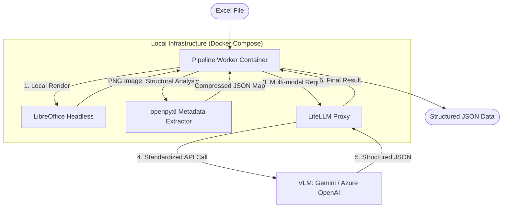

# **システムアーキテクチャ定義**

本システムは、Excelドキュメントの視覚情報（画像）と論理構造（メタデータ）を組み合わせ、VLM（Vision Language Model）を用いて高度な構造化データ抽出を実現する。

## **1. システム全体図**

## **2. 主要コンポーネントの役割**

### **A. Pipeline Worker (Python 3.10+)**
- **オーケストレーター:** 全体の処理フローを管理。
- **並行処理管理:** `ProcessPoolExecutor` を使用し、マルチコアを最大限活用。
- **データの正規化:** 画像のBase64化とメタデータの統合。

### **B. Rendering Engine (LibreOffice Headless)**
- **役割:** Excelを外部APIなしでPNGに変換。
- **隔離:** 競合を避けるため、プロセスごとに一時的な `UserInstallation` プロファイルを作成。
- **アーティファクト除去:** ヘッダー・フッター・余白を排除したテンプレートを使用。

### **C. Metadata Extractor (openpyxl + SheetCompressor)**
- **役割:** セルの結合、背景色、罫線、データ型を抽出。
- **圧縮:** 連続する同一フォーマットのセルをアンカーに基づき集約し、トークン消費を抑制。

### **D. LLM Gateway (LiteLLM)**
- **役割:** プロバイダー（Google, Microsoft, OpenAI）のAPI差異を吸収。
- **共通IF:** OpenAI互換のエンドポイントをWorkerに提供。
- **セキュリティ:** APIキーを一元管理。

## **3. データフロー詳細**

1.  **入力:** Excelファイルが指定のディレクトリに配置される。
2.  **前処理 (並列実行):**
    - **Visual Branch:** LibreOfficeが起動し、シートをPNGとしてレンダリング。
    - **Logical Branch:** `openpyxl` がXMLをパースし、構造情報を抽出。
3.  **統合:** PNGをBase64文字列に、構造情報を軽量なJSONに変換。
4.  **VLM推論:** LiteLLM経由でマルチモーダル・プロンプトを送信。
5.  **出力:** Pydanticで定義されたスキーマに準拠したJSONを保存。
