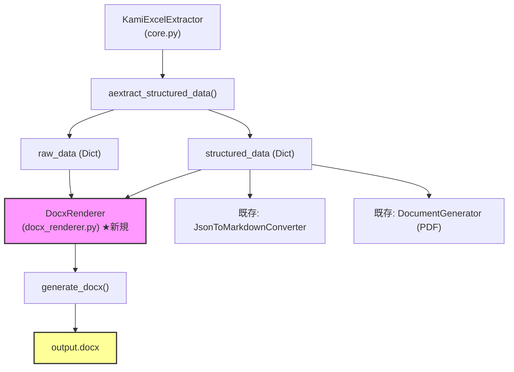

# Dify最適化 DOCX変換機能 — 詳細技術レポート

## 1. エグゼクティブサマリー

本レポートは、`kami_excel_extractor` にDify RAGパイプラインと高い親和性を持つDOCX出力機能を追加するための、技術的調査・考察・実装計画を詳述する。

### 目的

- Excelから抽出した構造化データを、Difyのナレッジエンジンが**最大限に活用できる形式**のDOCXに変換する
- 結合セルを含む複雑な表構造を**忠実に再現**する
- 画像・キャプション・見出し・ページ区切りをDifyの解析ロジックに最適化された構造で配置する

### 結論

`python-docx` はWordのセル結合（水平/垂直）を完全にサポートしており、既存の `MetadataExtractor._get_merged_cells_map()` が生成する結合情報をそのまま活用することで、**Excelの結合セル構造をWord表に忠実に変換可能**である。

---

## 2. Difyにおける DOCX の優位性

### 2.1 なぜDOCXが「最強」なのか

| 観点 | Markdown | PDF | DOCX |
|:---|:---|:---|:---|
| **構造メタデータ** | 記号依存（`#`, `|`）で曖昧 | なし（レイアウト情報のみ） | **スタイルタグ**として内部保持 |
| **見出しチャンク分割** | パーサー依存で不安定 | 不可能 | **Heading スタイルを境界として自動分割** |
| **表構造の保持** | セル結合不可 | テキスト化で崩壊 | **colspan/rowspan が XML レベルで保持** |
| **画像+コンテキスト** | パスのみ（実体なし） | 埋め込み可能だが文脈欠落 | **画像＋キャプションを同一チャンク内に結合** |
| **Difyパーサー精度** | 中 | 低 | **高** |

### 2.2 Difyの DOCX 解析フロー

```
DOCX アップロード
  ↓
WordExtractor (python-docx / unstructured)
  ↓
Heading スタイル検出 → チャンク境界の決定
  ↓
Table 検出 → Markdown テーブルに変換（構造保持）
  ↓
Image 検出 → 前後テキストとコンテキスト結合
  ↓
Embedding → ベクトルインデックス化
```

**重要**: Difyは `Heading 1` / `Heading 2` スタイルをチャンク分割の「論理的な区切り」として優先的に使用する。これにより、シート名やセクション名で検索精度が大幅に向上する。

---

## 3. 結合セルの技術的考察

### 3.1 既存の結合セル情報の取得

`kami_excel_extractor` の [`MetadataExtractor._get_merged_cells_map()`](file:///home/nobuhiko/Project/kami_excel_extractor/src/kami_excel_extractor/extractor.py#L295-L314) は、既にopenpyxlの結合セル情報を完全に解析している：

```python
def _get_merged_cells_map(self, ws):
    merged_map = {}
    for m_range in ws.merged_cells.ranges:
        for r, c in m_range.cells:
            if r == m_range.min_row and c == m_range.min_col:
                # 結合の起点セル → colspan/rowspan 情報を記録
                merged_map[(r, c)] = {
                    "colspan": m_range.max_col - m_range.min_col + 1,
                    "rowspan": m_range.max_row - m_range.min_row + 1,
                }
            else:
                # 結合に含まれるが起点ではないセル → スキップマーク
                merged_map[(r, c)] = "skip"
    return merged_map
```

この情報は、HTML `<td>` 生成時に `colspan` / `rowspan` 属性として使用されている。**同じ情報をそのまま `python-docx` のセル結合に転用できる。**

### 3.2 python-docx での結合セル再現

`python-docx` は `cell.merge(other_cell)` メソッドで矩形領域のセル結合をサポートしている。

#### 変換アルゴリズム

```
入力: merged_map = {(r, c): {"colspan": n, "rowspan": m} | "skip"}
      cell_data = [(coord, value, style_info), ...]

手順:
1. 最大行数・最大列数でWord表を作成
   table = doc.add_table(rows=max_row, cols=max_col)

2. セルデータを充填（"skip" マークされたセルは飛ばす）
   for cell_info in cell_data:
       if merged_map.get((r, c)) != "skip":
           table.cell(r-1, c-1).text = value

3. 結合操作を実行（充填後に行う ← 重要）
   for (r, c), span in merged_map.items():
       if span != "skip":
           top_left = table.cell(r-1, c-1)
           bottom_right = table.cell(
               r-1 + span["rowspan"] - 1,
               c-1 + span["colspan"] - 1
           )
           top_left.merge(bottom_right)

4. ヘッダー行のスタイリング（太字）
```

#### 技術的制約と対策

| 制約 | 影響 | 対策 |
|:---|:---|:---|
| `merge()` は矩形のみ | L字型や不規則結合は不可 | Excelの結合セルは本来すべて矩形なので問題なし |
| 結合後のインデックスが変化 | `cell(r, c)` が結合済みセルを返す場合がある | **データ充填を先、結合を後**にする順序で解決 |
| openpyxl は1-indexed, python-docx は0-indexed | 座標のずれ | 変換時に `-1` オフセットを適用 |
| 複雑な結合でのスタイル適用 | 結合セルのフォント設定が全ての構成セルに反映されない | 結合後に `merged_cell.paragraphs[0].runs[0]` にスタイル適用 |

### 3.3 結合パターン別の動作検証計画

| パターン | Excel例 | Word再現難易度 | 対応方針 |
|:---|:---|:---|:---|
| **水平結合** | `A1:C1` (列見出し) | ★☆☆ 簡単 | `cell(0,0).merge(cell(0,2))` |
| **垂直結合** | `A1:A5` (行カテゴリ) | ★☆☆ 簡単 | `cell(0,0).merge(cell(4,0))` |
| **矩形結合** | `A1:C3` (タイトル領域) | ★★☆ 中程度 | `cell(0,0).merge(cell(2,2))` |
| **複数結合の混在** | 複数の独立した結合領域 | ★★★ 要注意 | 結合順序の制御が重要 |
| **ネスト的結合** | 隣接する結合領域が互いに影響 | ★★★ 要注意 | `InvalidSpanError` 防止のバリデーション |

---

## 4. DOCX 内部構造設計 — Dify黄金構造

### 4.1 論理構造の定義

```
Document
├── Heading 1: "{ファイル名}" (ドキュメントタイトル)
│
├── Heading 1: "{シート名1}"
│   ├── Paragraph (Normal): シートの説明/メタデータ
│   │
│   ├── Heading 2: "{セクション名}" (LLM抽出データの見出し)
│   │   ├── Paragraph: テキストデータ
│   │   ├── Table (Table Grid): 表データ
│   │   │   ├── Header Row (Bold): カラムヘッダー
│   │   │   ├── Data Rows: 値（結合セル対応）
│   │   │   └── 計算式注釈行 (必要に応じて)
│   │   │
│   │   ├── Paragraph (Caption): "【図：{画像の要約}】"
│   │   └── InlineShape (Picture): 埋め込み画像
│   │
│   └── PageBreak: シート区切り
│
├── Heading 1: "{シート名2}"
│   └── ...
│
└── (繰り返し)
```

### 4.2 Difyでの解釈マッピング

| 構造要素 | python-docx API | Difyでの解釈 |
|:---|:---|:---|
| ドキュメントタイトル | `doc.add_heading(title, level=1)` | ドキュメント全体のトピック特定 |
| シート見出し | `doc.add_heading(sheet_name, level=1)` | **チャンク分割の主要境界** |
| セクション見出し | `doc.add_heading(section, level=2)` | セクション内チャンクの意味的グルーピング |
| 本文 | `doc.add_paragraph(text, style='Normal')` | 検索対象の主要テキスト |
| 表 | `doc.add_table() + style='Table Grid'` | 表形式データとして認識、構造保持 |
| 表ヘッダー | `run.bold = True` | **コンテキストキーとして認識** |
| 画像キャプション | `doc.add_paragraph("【図：...】")` | Vision LLMのトリガーテキスト |
| 画像 | `doc.add_picture(path)` | キャプションと同一コンテキスト内で結合 |
| ページ区切り | `doc.add_page_break()` | セグメントプレビューでの明確な区切り |

### 4.3 計算式注釈の表現

既存の `ContextualChunkGenerator` が生成するインライン注釈をDOCX内でも保持する。

```
表の直下に注釈段落として配置:
┌──────────────────────────────────────────────┐
│ ℹ️ セル E15 は計算式 =SUM(E3:E14)（単位: JPY）│
│ から導出された集計値です。                      │
└──────────────────────────────────────────────┘
→ style='Quote' を適用し、視覚的にも区別
```

---

## 5. アーキテクチャ設計

### 5.1 新規モジュール: `docx_renderer.py`

既存アーキテクチャとの統合ポイント：



### 5.2 クラス設計

```python
class DocxRenderer:
    """
    構造化データからDify最適化DOCXを生成するレンダラー。
    
    結合セルを含む複雑な表構造を忠実に再現し、
    Difyのナレッジエンジンが最大限に活用できる
    スタイル構造を持つWord文書を生成する。
    """
    
    def __init__(self, output_dir: Path):
        self.output_dir = output_dir
        self.media_dir = output_dir / "media"
    
    def generate_docx(
        self,
        structured_data: Dict[str, Any],
        raw_data: Dict[str, Any],
        source_filename: str,
        output_name: Optional[str] = None,
        include_logic_annotations: bool = True,
        image_width_inches: float = 5.0,
    ) -> Path:
        """
        構造化データからDify最適化DOCXを生成する。
        
        Args:
            structured_data: LLM解析後の構造化データ
            raw_data: MetadataExtractorからの生データ（結合情報含む）
            source_filename: 元のExcelファイル名
            output_name: 出力ファイル名（省略時は source_filename ベース）
            include_logic_annotations: 計算式注釈を含めるか
            image_width_inches: 画像の幅（インチ）
            
        Returns:
            Path: 生成されたDOCXファイルのパス
        """
        ...
    
    def _add_sheet_section(
        self,
        doc: Document,
        sheet_name: str,
        sheet_data: Dict,
        raw_sheet: Dict,
    ) -> None:
        """シート単位のセクションを追加"""
        ...
    
    def _add_table_with_merges(
        self,
        doc: Document,
        table_data: List[Dict],
        cells: List[Dict],
        merged_map: Dict,
    ) -> None:
        """結合セルを含む表をWord表として追加"""
        ...
    
    def _add_image_with_caption(
        self,
        doc: Document,
        media_item: Dict,
        image_width: float,
    ) -> None:
        """キャプション付き画像を追加"""
        ...
    
    def _add_logic_annotations(
        self,
        doc: Document,
        cells: List[Dict],
    ) -> None:
        """計算式の注釈段落を追加"""
        ...
    
    def _apply_header_style(
        self,
        row: TableRow,
    ) -> None:
        """表のヘッダー行にDify最適化スタイルを適用"""
        ...
    
    def _rebuild_merged_map_from_raw(
        self,
        raw_sheet: Dict,
    ) -> Dict:
        """raw_dataのcells情報からmerged_mapを再構築"""
        ...
```

### 5.3 結合セル再現の詳細フロー

```
入力: raw_sheet["cells"] に含まれる結合情報

Step 1: 結合マップの再構築
  cells の各要素から "colspan", "rowspan" 属性を抽出
  → merged_map: {(row, col): {"colspan": n, "rowspan": m}}

Step 2: テーブルグリッドの決定
  - max_row, max_col を計算
  - doc.add_table(rows=max_row, cols=max_col)

Step 3: データの充填
  for cell in cells:
      if cell に "skip" マークがない:
          table.cell(row-1, col-1) にテキストを設定

Step 4: 結合の適用（充填完了後に実行）
  for (row, col), span in merged_map.items():
      if span != "skip":
          top_left = table.cell(row-1, col-1)
          bot_right = table.cell(
              row-1 + span["rowspan"]-1,
              col-1 + span["colspan"]-1
          )
          top_left.merge(bot_right)

Step 5: ヘッダースタイルの適用
  - 1行目（または太字セル）に bold = True を適用
  - Table Grid スタイルを設定
```

---

## 6. core.py への統合

### 6.1 新規メソッド: `aextract_docx()`

```python
async def aextract_docx(
    self,
    excel_path: Union[str, Path],
    options: Optional[RagOptions] = None,
) -> Tuple[Path, Dict]:
    """
    Excelを解析し、Dify最適化DOCXを生成する。
    
    Returns:
        Tuple[Path, Dict]: (DOCXファイルパス, 構造化データ)
    """
    opts = options or RagOptions()
    excel_path = Path(excel_path)
    
    # 既存のパイプラインで構造化データを取得
    structured_data = await self.aextract_structured_data(excel_path, ...)
    raw_data = await self._get_raw_extraction_results(excel_path, ...)
    
    # DOCX生成
    renderer = DocxRenderer(self.output_dir)
    docx_path = await asyncio.to_thread(
        renderer.generate_docx,
        structured_data=structured_data,
        raw_data=raw_data,
        source_filename=excel_path.name,
        include_logic_annotations=opts.include_logic_annotations,
    )
    
    return docx_path, structured_data
```

### 6.2 CLI の拡張

```python
# cli.py への追加オプション
parser.add_argument(
    "--docx",
    action="store_true",
    help="Dify最適化DOCX形式でも出力する"
)

# --rag-format に "docx" 選択肢を追加
parser.add_argument(
    "--rag-format",
    choices=["markdown", "yaml_frontmatter", "jsonl", "docx"],
    ...
)
```

---

## 7. 依存パッケージ

### 7.1 追加が必要なパッケージ

| パッケージ | バージョン | 用途 |
|:---|:---|:---|
| `python-docx` | `>=1.1.0` | Word文書の生成・操作 |

**注**: `python-docx` は純Python実装であり、外部バイナリ依存はない。Dockerコンテナにも容易にインストール可能。

### 7.2 pyproject.toml への追加

```toml
dependencies = [
    ...
    "python-docx>=1.1.0",
]
```

---

## 8. テスト計画

### 8.1 ユニットテスト

| テストケース | 検証内容 |
|:---|:---|
| `test_docx_basic_generation` | 基本的なDOCX生成と構造確認 |
| `test_docx_heading_structure` | Heading 1/2 の正しいスタイル適用 |
| `test_docx_table_no_merge` | 結合なし単純テーブルの生成 |
| `test_docx_table_horizontal_merge` | 水平結合セルの再現 |
| `test_docx_table_vertical_merge` | 垂直結合セルの再現 |
| `test_docx_table_rectangular_merge` | 矩形結合セルの再現 |
| `test_docx_table_multiple_merges` | 複数結合領域の混在 |
| `test_docx_table_header_bold` | ヘッダー行の太字スタイル |
| `test_docx_image_with_caption` | キャプション+画像の配置順序 |
| `test_docx_page_break_between_sheets` | シート間ページ区切り |
| `test_docx_logic_annotations` | 計算式注釈の挿入 |
| `test_docx_empty_sheet` | 空シートのハンドリング |
| `test_docx_large_table` | 大規模テーブル（1000行超）のメモリ安全性 |

### 8.2 統合テスト

| テストケース | 検証内容 |
|:---|:---|
| `test_end_to_end_excel_to_docx` | Excel→構造化→DOCX の完全パイプライン |
| `test_cli_docx_option` | `--docx` フラグのCLI動作確認 |
| `test_docx_with_real_data` | `complex_report.xlsx` での実データ検証 |

### 8.3 Dify互換性の検証（手動）

1. 生成したDOCXをDifyにアップロード
2. チャンク分割プレビューで以下を確認:
   - シートごとに独立チャンクが生成されているか
   - 表構造が崩壊せず保持されているか
   - 画像がキャプションとセットで認識されているか
3. 検索テスト: 特定シート名での検索でピンポイントヒットするか

---

## 9. エッジケースと対策

### 9.1 結合セルに関するエッジケース

| ケース | リスク | 対策 |
|:---|:---|:---|
| 結合範囲がテーブル境界を超える | `IndexError` | bounding box 計算で事前に最大範囲を拡張 |
| 同一セルへの二重結合 | `InvalidSpanError` | 処理済みセルの追跡セットで重複防止 |
| 結合セルの値が None | 空セルが表示される | 結合元セルの値のみを使用（openpyxlの仕様通り） |
| 1行1列の「結合」（実質非結合） | 不要な merge() 呼び出し | colspan=1 かつ rowspan=1 の場合はスキップ |

### 9.2 画像に関するエッジケース

| ケース | リスク | 対策 |
|:---|:---|:---|
| 画像ファイルが存在しない | FileNotFoundError | 存在チェック + キャプションのみ挿入 |
| 画像が巨大（20MB超） | メモリ問題 | 既存の MAX_IMAGE_BYTES 制限を適用 |
| 画像形式がWord非対応 | 挿入失敗 | PNG/JPEG への変換フォールバック |

### 9.3 テキストに関するエッジケース

| ケース | リスク | 対策 |
|:---|:---|:---|
| セル値に制御文字 | DOCX破損 | `clean_kami_text()` の既存サニタイズを適用 |
| 極端に長いセル値 | レイアウト崩壊 | 文字数制限（10000文字）でトランケート |
| 日本語フォントの欠落 | 文字化け | DOCXはフォント埋め込み不要（OS依存） |

---

## 10. 実装ロードマップ

### Phase 1: 基盤実装（優先度: 高）

- [ ] `python-docx` を依存に追加
- [ ] `docx_renderer.py` の骨格を作成
  - `DocxRenderer` クラス
  - `generate_docx()` メソッド
  - `_add_sheet_section()` メソッド
- [ ] 基本的な見出し + 段落 + ページ区切りの生成
- [ ] ユニットテスト（基本構造）

### Phase 2: 表・結合セル対応（優先度: 高）

- [ ] `_add_table_with_merges()` の実装
  - 結合マップの再構築ロジック
  - データ充填 → 結合 の二段階処理
  - ヘッダー行の太字スタイル適用
- [ ] `Table Grid` スタイルの適用
- [ ] ユニットテスト（全結合パターン）

### Phase 3: 画像・メディア対応（優先度: 中）

- [ ] `_add_image_with_caption()` の実装
  - キャプション段落の挿入（画像の直上）
  - `doc.add_picture()` での画像挿入
  - 画像サイズの適切な制限
- [ ] メディアファイルの存在チェックとフォールバック
- [ ] ユニットテスト（画像）

### Phase 4: 統合・CLI対応（優先度: 中）

- [ ] `core.py` に `aextract_docx()` / `extract_docx()` を追加
- [ ] `cli.py` に `--docx` オプションを追加
- [ ] `--rag-format docx` の追加
- [ ] 統合テスト

### Phase 5: 計算式注釈・検証（優先度: 低）

- [ ] `_add_logic_annotations()` の実装
- [ ] `complex_report.xlsx` での実データ検証
- [ ] Difyへの手動アップロード検証
- [ ] ドキュメント更新（README, RAG最適化ガイド）

---

## 11. ファイル変更一覧

| ファイル | 操作 | 内容 |
|:---|:---|:---|
| `src/kami_excel_extractor/docx_renderer.py` | **新規作成** | DocxRenderer クラス |
| `src/kami_excel_extractor/core.py` | 修正 | `aextract_docx()` メソッド追加、import追加 |
| `src/kami_excel_extractor/cli.py` | 修正 | `--docx` オプション追加 |
| `src/kami_excel_extractor/schema.py` | 修正 | `RagOptions` に docx 関連オプション追加（必要に応じて） |
| `pyproject.toml` | 修正 | `python-docx>=1.1.0` 依存追加 |
| `tests/test_docx_renderer.py` | **新規作成** | ユニットテスト |
| `tests/test_docx_integration.py` | **新規作成** | 統合テスト |
| `docs/rag_optimization_guide.md` | 修正 | DOCX出力に関するセクション追加 |

---

## 12. 参考: python-docx の主要 API

本実装で使用する `python-docx` の主要APIを以下に整理する。

```python
from docx import Document
from docx.shared import Inches, Pt, Cm
from docx.enum.text import WD_ALIGN_PARAGRAPH

# ドキュメント作成
doc = Document()

# 見出し（Difyチャンク境界）
doc.add_heading("シート名", level=1)
doc.add_heading("セクション名", level=2)

# 段落
para = doc.add_paragraph("本文テキスト", style='Normal')

# 表の作成
table = doc.add_table(rows=5, cols=4)
table.style = 'Table Grid'

# セル結合
cell_a = table.cell(0, 0)  # 0-indexed
cell_b = table.cell(1, 2)
cell_a.merge(cell_b)  # (0,0) から (1,2) までの矩形を結合

# ヘッダー行の太字
for cell in table.rows[0].cells:
    for paragraph in cell.paragraphs:
        for run in paragraph.runs:
            run.bold = True

# 画像
doc.add_picture("image.png", width=Inches(5.0))

# ページ区切り
doc.add_page_break()

# 保存
doc.save("output.docx")
```
